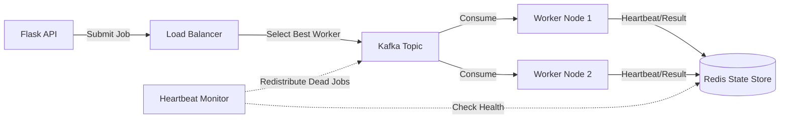

# YADTQ (Yet Another Distributed Task Queue)

**A high-performance, fault-tolerant distributed task coordination system engineered with Python, Apache Kafka, and Redis.**


## 📖 Overview

YADTQ is not just a wrapper around `multiprocessing`. It is a distributed system designed to handle **node failures** and **unbalanced workloads** in production environments. Unlike simple round-robin queues, YADTQ implements a **custom adaptive load balancer** and a **self-healing heartbeat monitor** that detects dead workers and automatically redistributes their tasks, ensuring Zero Data Loss even during catastrophic worker crashes.

### 🚀 Key Features

* **🧠 Adaptive Load Balancing:** Uses a custom scoring algorithm (`Load Score = Active Tasks + Recency Bias`) to route jobs to the most capable worker, preventing "hot spots" in the cluster.
* **❤️ Self-Healing Architecture:** A dedicated background thread monitors worker heartbeats. If a worker goes silent for >30s, the system marks it as dead and performs an atomic transaction to seize its locks and redistribute pending jobs.
* **🛡️ At-Least-Once Delivery:** Leverages Kafka's offset management combined with Redis-backed state tracking (`queued` -> `processing` -> `completed`) to ensure no job is ever lost.
* **📊 Real-Time Observability:** Tracks worker states (`free`, `processing`, `initializing`) and granular job progress via a standardized Redis schema.

## 🏗️ System Architecture

The system follows a **Producer-Consumer** pattern decoupled by Apache Kafka, with Redis acting as the "Brain" for state management.



## The "Secret Sauce" (Core Logic)

### 1. The "Least-Loaded" Scheduler

Instead of random assignment, the JobProducer calculates a real-time score for every active worker before dispatching a job:

```python
# Lower score = Better candidate
score = task_count + max(0, (current_time - last_assigned_time) * -0.1)
```

This ensures that workers who just finished a heavy task aren't immediately bombarded again, smoothing out latency spikes.

### 2. Fault Tolerance (The "Reaper")

The `monitor_worker_heartbeats` thread runs continuously on the leader node.

- **Detection:** Scans Redis for worker heartbeats older than 30 seconds.
- **Isolation:** Removes the dead worker from the `active_workers` set.
- **Recovery:** Queries the `job_tracking` hash for any job locked by that worker ID, resets its status to `queued`, increments `retry_count`, and pushes it back to Kafka.

## 📂 Project Structure

*(Note: The stable production release is on the `final_version` branch.)*

```bash
yadtq/
├── core/
│   ├── message_queue.py     # Kafka Producer/Consumer wrappers + Load Balancer logic
│   ├── task_processor.py    # Worker Engine: Handles execution, heartbeats, and self-healing
│   ├── result_store.py      # Redis Interface for state management
│   ├── job_recovery.py      # Logic for handling failed/orphaned jobs
│   └── config.py            # System constants (timeouts, retries)
├── client/
│   ├── app.py               # Flask API for job submission
│   └── client.py            # Client SDK
├── tests/                   # Chaos Engineering tests (test_failures.py)
└── setup.py                 # Package installation
```

## ⚡ Quick Start

### Prerequisites

- Python 3.8+
- Apache Kafka (Running on localhost:9092)
- Redis (Running on localhost:6379)

### 1. Installation

Clone the repository and checkout the stable branch:

```bash
git clone https://github.com/yourusername/yadtq.git
cd yadtq
git checkout final_version
pip install -e .
```

### 2. Start the Worker Nodes

Launch multiple workers in separate terminals to simulate a distributed cluster.

```bash
# Terminal 1
python -m yadtq.core.task_processor worker-1

# Terminal 2
python -m yadtq.core.task_processor worker-2
```

### 3. Start the Client API

```bash
python yadtq/client/app.py
# Server running at http://127.0.0.1:5001
```

### 4. Submit a Job

You can use the Web UI or curl:

```bash
curl -X POST http://127.0.0.1:5001/submit_job \
  -F "job_type=add" \
  -F "arg1=10" \
  -F "arg2=20"
```
